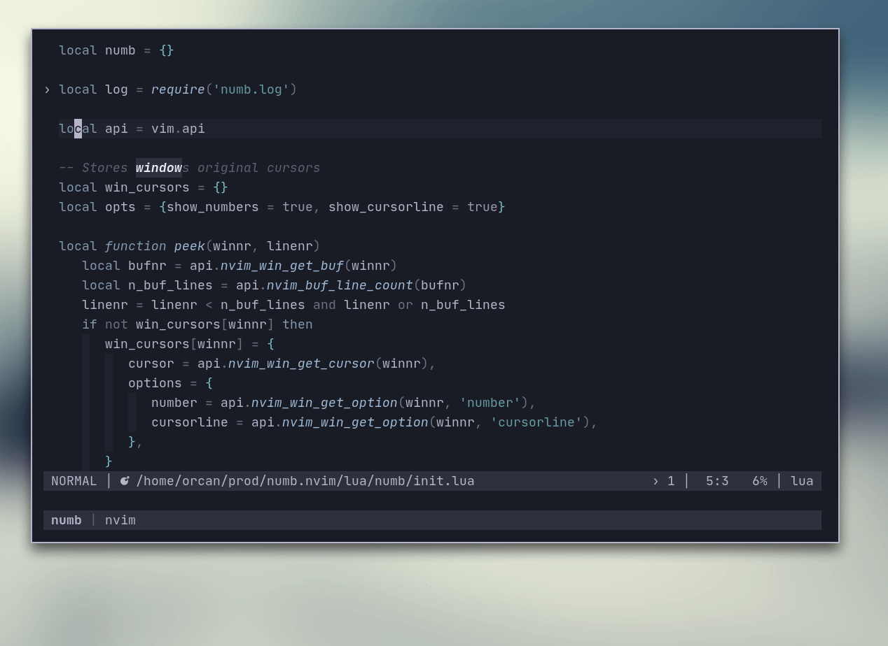

# numb.nvim

numb.nvim is a Neovim plugin that peeks lines of the buffer in non-obtrusive
way.

## Features

- Peeking buffer while entering command `:{number}`



## Installation

### Packer

```lua
use 'nacro90/numb.nvim'
```

### Paq

```lua
paq 'nacro90/numb.nvim'
```

### Plug

```viml
Plug 'nacro90/numb.nvim'
```

## Usage

Setup with default options:

```lua
require('numb').setup()
```

Disable the plugin globally:

```lua
require('numb').disable()
```

After you disable the plugin, you can re-enable it by calling the `setup` again.

### Options

You can customize the behaviour with following:

```lua
require('numb').setup{
   show_numbers = true, -- Enable 'number' for the window while peeking
   show_cursorline = true -- Enable 'cursorline' for the window while peeking
}
```

After running `setup`, you are good to go. You can try with entering a number to
the vim command line like `:3`.

When you disable numb, your options are kept in the module level. So after you
disable it, if you call `setup()` with no overrides, numb will be enabled with
your customized options (or default ones if you don't have any). You can
override the options again with calling `setup{...}` as mentioned above.
